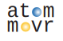

## A simulation framework for rearrangement in atomic arrays

by Nikhil Kiran Harle* ([khnikhil](https://github.com/khnikhil/khnikhil)), Bo-Yu Chen* ([phys-mattchen](https://github.com/phys-mattchen)), Bob Bao, and Hannes Bernien.

## ~~Fantastic beasts~~ Key features and `where to find them`


:books: Open-source library of rearrangement algorithms:   `atommover.algorithms/`

:movie_camera: Visualization of rearrangement process: `atommover.utils.animation.py`

:computer: Experimentally-relevant error modelling: `atommover.utils.ErrorModel.py`

:chart_with_upwards_trend: Flexible benchmarking suite for running experiments: `atommover.utils.benchmarking.py`

:toolbox: Core utils for moving atoms and simulating stochastic loading: `atommover.utils.core.py` and `atommover.utils.move_utils.py`


# Use

## Getting started
Want to learn how to use this code? Curious about what it means to be an atom mover?  Head on over to [`tutorial.ipynb`](tutorial.ipynb).

Want to reproduce the figures from our paper? Check out [`paper_figures.ipynb`](paper_figures.ipynb).

Want to add an algorithm to the library, or make your own? Check out our template in [`atommover.algorithms.Algorithm.py`](/atommover/algorithms/Algorithm.py).

Want to add some features and/or make this code nicer? Check out [`CONTRIBUTING.md`](CONTRIBUTING.md).


##  Installation

To make the virtual environment, navigate to the main folder and run the following command in Terminal/Powershell: 
```
conda env create -f environment.yml
```

# Acknowledgments

## Collaborators and discussions

Shraddha Anand, Will Eckner, Noah Glachman, Andy Goldschmidt, Kevin Singh, Mariesa Teo, and Nayana Tiwari.

## External code
- [bottled](https://gitlab.inria.fr/bora-ucar/bottled): (copied into [`\PPSU2023`](/PPSU2023/README.md))
  - Authors: Ioannis Panagiotas, Grégoire Pichon, Somesh Singh, Bora Uçar. 
  - Reference: *Engineering fast algorithms for the bottleneck matching problem.* ESA 2023 - The 31st Annual European Symposium on Algorithms, Sep 2023, Amsterdam (Hollande), Netherlands. [⟨hal-04146298v2⟩](https://inria.hal.science/hal-04146298v2)

## Funding sources
* Office of Naval Research (Grant No. N00014-23-1-2540)
* Air Force Office of Scientific Research (Grant No. FA9550-21-1-0209)
* Army Research Office (Grant no. W911NF2410388) 
* Nikhil acknowledges support from the National Science Foundation Graduate Research Fellowship (Grant No. DGE-2040434) 
* Bo-Yu acknowledges support from the UChicago-Taiwan Student Exchange (UCTS) fellowship, National Taiwan University Fu Bell Scholarship, National Taiwan University College of Science Travel Grants and Chuan-Pu Lee Memorial Scholarship.

Correspondence and request for materials should be directed to [Hannes](hannes.bernien@uibk.ac.at).
